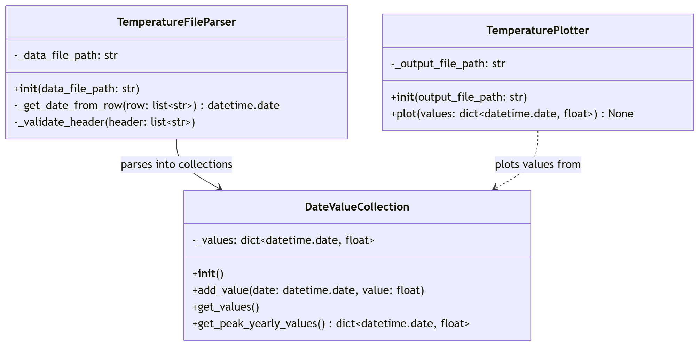
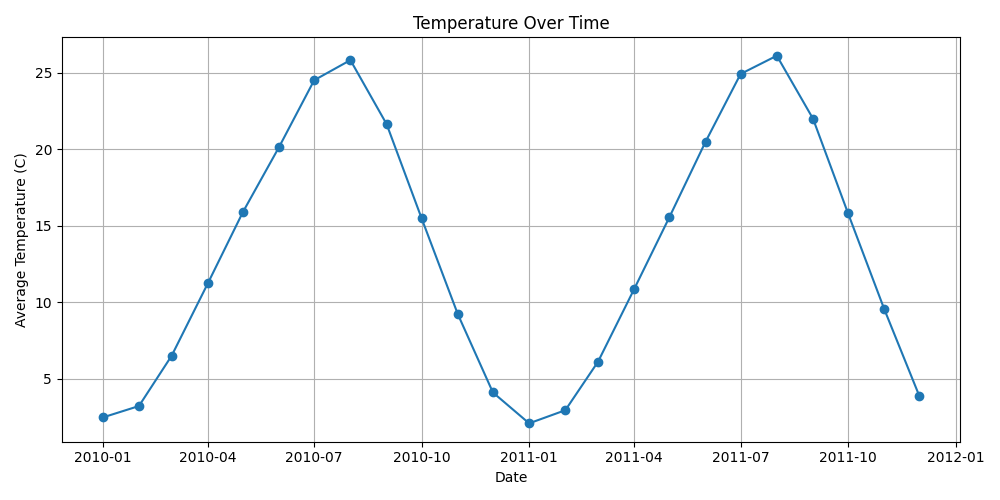

# Temperature Plotter Library

Build a small Python library that parses temperature data, stores it by country/date, and generates a plot image.

The main goal is not only to "make it work," but to understand your code and explain the program design decisions during code review.

## Project Goals

- Build a solution incrementally with many small commits.
- Practice object-oriented design with multiple collaborating classes.
- Gain experience using a test harness to debug a library.
- Parse data files using common validation patterns.
- Handle bad input and edge cases appropriately.
- Gain experience using third party libraries and managing dependencies.

## What You Receive in the Starter Repo

- Starter test harness:
  - `main.py`
- Class diagram image:
  - `documentation/class_diagram.png`
- Example plot image:
  - `documentation/example_temperature_plot.png`
- Data files:
  - `data/sample_data_partial.csv`
  - `data/sample_data_full.csv`
- Requirements file for installing dependencies:
  - `requirements.txt`

## Class Descriptions

You must create the following classes.

**Refer to this class diagram image for expected class members and behavior. All properties and methods shown in the diagram must appear in your implementation.**

### `DateValueCollection`

Responsibilities:

- Stores a collection of date-value pairs
- Critical errors should raise an error and must be handled by the caller
  - Duplicate key added
- Provides a way to get all values in the collection
- Provides a way to get the peak (max) yearly values for the collection

### `TemperatureFileParser`

Responsibilities:

- Parses a temperature file and returns a dictionary of country -> DateValueCollection
- Critical errors should raise an error and must be handled by the caller
  - Bad file path
  - Malformed header (missing expected columns or columns in unexpected order)
- Non-critical errors should skip the row and print a descriptive error message
  - Empty row
  - Empty value
  - Bad date format (must be in YYYY-MM-DD format)

### `TemperaturePlotter`

Responsibilities:

- Plots a dictionary of sorted date -> temperature values
- Critical errors should raise an error and must be handled by the caller
  - Bad file path
  - No values to plot

## Example Plot

Expected style/output example:

## Running the Project

1. Create a virtual environment, either in VS Code or on the command line
2. Install dependencies:
   - `pip install -r requirements.txt`
3. Use `main.py` as your local sandbox to test parser and plotter behavior.

## AI Usage Expectations

AI is allowed and encouraged for this assignment, but you must follow the best practices from lecture.

- You are responsible for understanding every line of code you submit.
- Use AI to explain code, edge cases, and design tradeoffs.
- If AI gives code you cannot explain, ask it for a simpler/beginner-friendly version.
- Ask AI for one small implementation step at a time (not a full final solution all at once).
- If unsure of how to approach the problem, you may ask AI for guidance.

## Commit Workflow Requirement

You must implement this project in **many small commits** with descriptive commit messages.

- Avoid giant commits. Each class should have several commits.
- Don't move on to the next piece of the program until you have tested the current functionality through your test harness (main file).
- Don't move on to the next piece of the program until you are comfortable that you understand the current functionality.
- Always commit before asking the AI to make changes!

## Suggested Implementation Order

1. `DateValueCollection`
2. `TemperatureFileParser`
3. `TemperaturePlotter`
4. Integration testing in `main.py`
